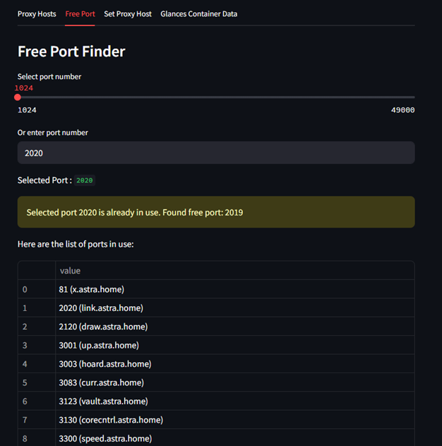

# NginxPMControl

NginxPMControl is a Python-based application that interacts with the Nginx Proxy Manager API to manage proxy hosts, certificates, and container data. It also integrates with the Glances API to fetch container information.

## Features

- **Proxy Host Management**: Retrieve, display, and set proxy hosts using the Nginx Proxy Manager API.
- **Certificate Management**: Fetch and associate certificates with proxy hosts.
- **Port Management**: Find and display available ports for proxy hosts.
- **Container Data**: Fetch and display container data from Glances servers.

## Requirements

- Python 3.12 or higher
- Docker (optional for containerized deployment)

## Installation

1. Clone the repository:
   ```bash
   git clone https://github.com/rajivvishwa/NginxPMControl.git
   cd NginxPMControl
   ```

2. Create a virtual environment and activate it:
   ```bash
   uv venv
   source .venv/bin/activate  # On Windows: .venv\Scripts\activate
   ```

3. Install dependencies using `uv`:
   ```bash
   uv sync
   ```

4. Create a `.env` file in the root directory based on the `env_sample` file:
   ```bash
   cp env_sample .env
   ```
   Update the `.env` file with your configuration.

## Usage

### Running Locally

1. Start the application:
   ```bash
   streamlit run main.py
   ```

2. Open your browser and navigate to `http://localhost:8501`.

### Running with Docker

1. Build the Docker image:
   ```bash
   docker build -t nginxpmcontrol .
   ```

2. Run the container:
   ```bash
   docker run -d -p 8501:8501 -v "$(pwd)/.env:/.env" nginxpmcontrol
   ```

### Running with Docker Compose

1. Start the services:
   ```bash
   docker-compose up --build
   ```

2. Open your browser and navigate to `http://localhost:8501`.

## Screenshots

Here are some screenshots of the application:

### List Proxy Hosts


### Check Used/Free Ports


### Create New Proxy Host


### Containers List (from Glances)


## Project Structure

- `main.py`: Entry point for the Streamlit application.
- `ngnixpm_auth.py`: Handles authentication with the Nginx Proxy Manager API.
- `ngnixpm_proxyhosts.py`: Manages proxy hosts and certificates.
- `glances_api.py`: Fetches container data from Glances servers.
- `Dockerfile`: Docker configuration for building the application image.
- `docker-compose.yml`: Docker Compose configuration for running the application.
- `.env`: Environment variables for the application.
- `env_sample`: Sample environment variables file.

## Environment Variables

The application uses the following environment variables:

- `NPM_API_URL`: Base URL for the Nginx Proxy Manager API.
- `NPM_IDENTITY`: Identity (email) for authentication.
- `NPM_SECRET`: Secret key for authentication.
- `DEFAULT_DOMAIN`: Default domain for proxy hosts.
- `DEFAULT_HOST`: Default host for proxy hosts.
- `GLANCES_SERVERS`: Comma-separated list of Glances server IPs.

## Contributing

Contributions are welcome! Please fork the repository and submit a pull request.

## License

This project is licensed under the MIT License. See the `LICENSE` file for details.
